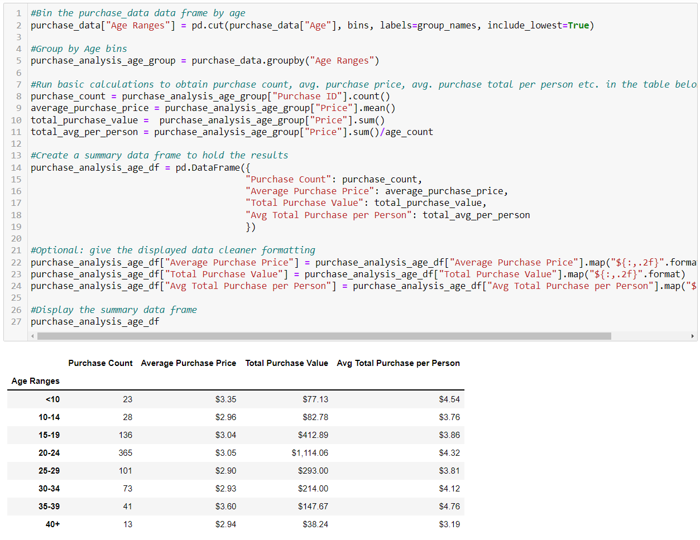

# Game Item Purchase Data Insights

 

### Summary
Analysis of game virtual item purchase data to obtain meaningful insights.

 

### Data Preview

 

* This is a preview of what the CSV raw data looks like.

 

### Pandas
Used various Pandas functions to manipulate and arrange the data to extract meaninful insights such as:
* Number of unique players that made purchases
* Total number of unique items purchased and the Average Price and Total Number of Purchases.
* Gender Demographics - Total count of players that made a purchase for each gender, as a number and as a percentage.
* Purchasing Analysis by Gender - Number of Purchases and Average Purchase Price and Average Spend per person by Gender.
* Age Demographics - Displaying a player count for each age bin/group number of players and displaying percentage of players for each age group.
* Top spenders - Identifying which users made the most purchases with greatest average purchases price and total purchase value.
* Most Popular Items - Identifying which Items are purchased the most by number of Purchases.
* Most Profitable Items - Identifying which items bring the most revenue by sorting by Total Purchase Value.  

 

### Code and output examples

Here are some examples of the code and it's output:
 

#### Purchase Analysis by Gender

 

#### Purchase Analysis by Age

 

#### Popular Items

 
 
### Some observable insights from the data

* An overwhelming majority of the purchases are made by Males - 84% of the purchases were made by players who identified as male.
* The Average Total Purchase per Person for Females is slightly higher than for males so females spend slightly more on average than males.
* Nearly half the purchases are from players between 20 and 24 years old - 44.79% - this demographic purchases significantly more than other age groups.
* Some players purchased multiple times.
* Final Critic and Oathbreaker are the most popular and most profitable items.

 

 

### Abz Raja
abzraja@gmail.com
